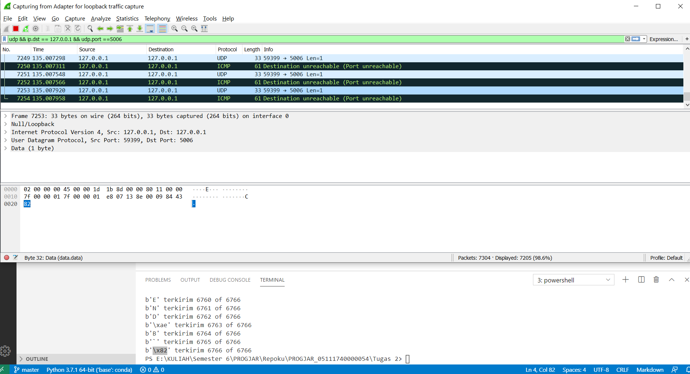
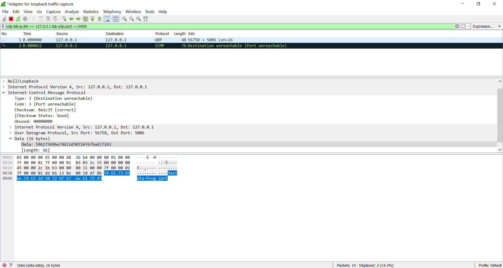
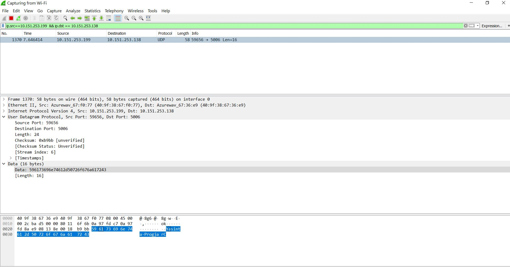

# Tugas 2
### Mengunakan wireshark, capture :
### 1. Hasil keluaran dari program udpfileclient.py ke alamat 127.0.0.1 ke port 5006

### 2. Hasil keluaran dari program udp_simple.py ke alamat 127.0.0.1 ke port 5006

### 3. Gambar "capture_udpfileclient_beda_pc"
Merupakan hasil dari program udpfileclient_beda_komputer.py, dari alamat PC saya '10.151.253.199' menuju ip '10.151.253.138', data yang dikirim yaitu file 'bart.png'

### 4. Gambar "capture_udp_simple_beda_pc"
Merupakan hasil dari program udp_simple_beda_komputer.py, dari alamat PC saya '10.151.253.199' menuju ip '10.151.253.138', data yang dikirim yaitu kalimat 'Yasinta-ProgjarC'

