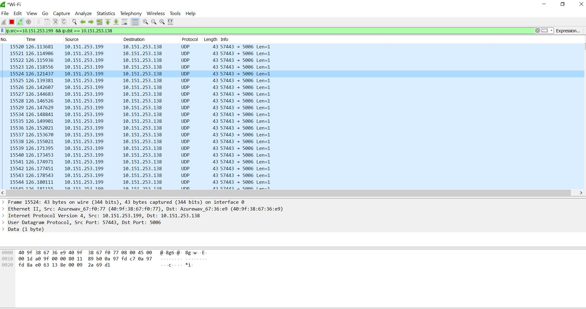

# Tugas 2
### Mengunakan wireshark, capture :
### 1. Hasil keluaran dari program udpfileclient.py ke alamat 127.0.0.1 ke port 5006
* Ubah file udpfileclient.py, ganti TARGET_IP menjadi **127.0.0.1** dan TARGET_PORT menjadi **5006**
* Karena menggunakan koneksi local klik 2x pada tulisan **Adapter for loopback traffic capture** dan isi filter menjadi **udp && ip.dst === 127.0.0.1 && udp.port == 5006**
* Berikut adalah hasil capture dari filter yang sudah dijalankan

* 

### 2. Hasil keluaran dari program udp_simple.py ke alamat 127.0.0.1 ke port 5006
* Ubah udp_simple.py, ganti TARGET_IP menjadi **127.0.0.1** dan TARGET_PORT menjadi **5006**
* Karena saya ingin mengirimkan pesan *Yasinta-ProgjarC* maka ubah programnya menjadi sock.sendto(bytes('Yasinta-ProgjarC'.encode()),(TARGET_IP,TARGET_PORT))
* Karena menggunakan koneksi local klik 2x pada tulisan **Adapter for loopback traffic capture** dan isi filter menjadi **udp && ip.dst === 127.0.0.1 && udp.port == 5006**
* Berikut adalah hasil capture dari filter yang sudah dijalankan

* 

### 3. Gambar "capture_udpfileclient_beda_pc"
Merupakan hasil dari program udpfileclient_beda_komputer.py, dari alamat PC saya '10.151.253.199' menuju ip '10.151.253.138', data yang dikirim yaitu file 'bart.png'

### 4. Gambar "capture_udp_simple_beda_pc"
Merupakan hasil dari program udp_simple_beda_komputer.py, dari alamat PC saya '10.151.253.199' menuju ip '10.151.253.138', data yang dikirim yaitu kalimat 'Yasinta-ProgjarC'
