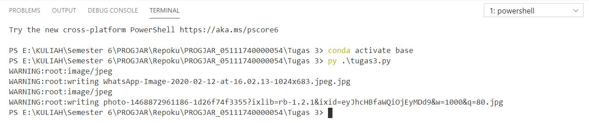

## Tugas 3

### Memodifikasi program agar dapat mendownload gambar menggunakan thread

Pada program ini thread dijalankan setelah semua url berada di arrray thread. Setelah program di jalankan nama file yang terdownload bernama Gambar1 dan seterusnya sesuai dengan jumlah url.

